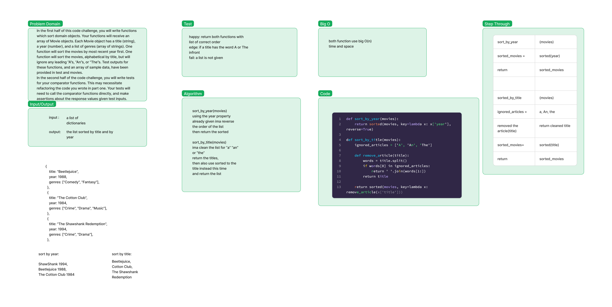

# Comparisons

In the first half of this code challenge, you will write functions which sort domain objects. Your functions will receive an array of Movie objects. Each Movie object has a title (string), a year (number), and a list of genres (array of strings). One function will sort the movies by most recent year first. One function will sort the movies, alphabetical by title, but will ignore any leading “A”s, “An”s, or “The”s. Test outputs for these functions, and an array of sample data, have been provided in test and movies.

In the second half of the code challenge, you will write tests for your comparator functions. This may necessitate refactoring the code you wrote in part one. Your tests will need to call the comparator functions directly, and make assertions about the response values given test inputs.

## Whiteboard Process

## Approach & Efficiency

Big O(n) for both time and space, i looking through each element once and i am only printing the sorted response

## Solution

Refer to whiteboard

-[code](https://github.com/houseofpython/data-structures-and-algorithms/blob/main/python/data_structures/comparisons.py)
-[test](https://github.com/houseofpython/data-structures-and-algorithms/blob/main/python/data_structures/comparisons_test.py)
